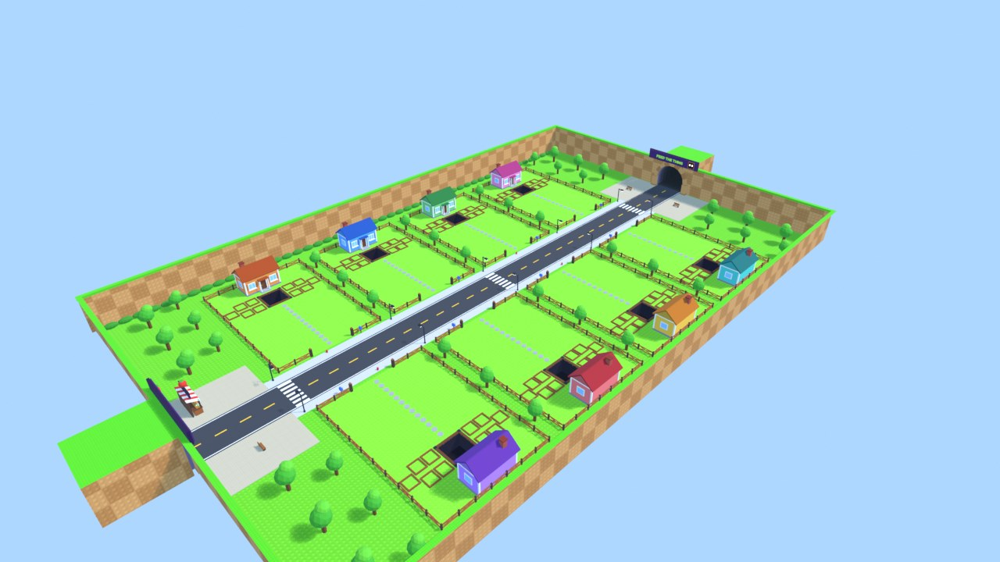

# The map, made in Blender

`build_map.py` builds the whole neighbourhood: the street, 8 plots with houses, fences, planters and hatch pits, trees, hedges, lamps, the seed stand and the two tunnels the delivery truck uses (SEED EXPRESS and FEED THE THING). It's a script, so the map can be rebuilt or changed any time.

| File | What it is |
|---|---|
| `Export/FeedTheThing_Map.fbx` | **Import this into Roblox Studio** (textures are inside) |
| `Map.blend` | The scene, to open and edit in Blender |
| `build_map.py` | The script that makes both |
| `Textures/` | Stud textures (grass, lawn, sidewalk, plaza, wall) + one colour palette |
| `Previews/` | Renders of the map |

## Import it into Studio

1. Open the **Avatar** tab (or File menu) and choose **Import 3D**. Pick `Export/FeedTheThing_Map.fbx`.
2. In the import window, leave the defaults. If there's a **Scale Unit** option, choose **Stud**.
3. Click **Import**. A model called `FeedTheThing_Map` appears. Its size and position in Studio don't matter, because the game lines it up when you press Play.
4. Rename it to **`Map`** and drag it into **ServerStorage**. Then save the place.
5. Press Play.

Without a `Map`, the game shows plain stand-in blocks and prints a reminder in the Output.

## Change the map

- **Small tweaks:** open `Map.blend`, edit, then export: File → Export → FBX with **Path Mode: Copy**, the "embed textures" button next to it turned on, and **Apply Unit Scale** ticked. Keep the three little `MapOrigin` / `MapMarkX` / `MapMarkZ` blocks, because the game uses them to line the map up.
- **Bigger changes:** edit `build_map.py` and run `blender --background --python build_map.py`. Plot positions and sizes must match `Config.World` in `ReplicatedStorage/Config.lua`.
- Each object must stay under 20,000 triangles (Roblox's limit per mesh). The script checks this.

Objects named `Glow_RRGGBB` (lamp bulbs, the eyes on the FEED THE THING sign) are turned into glowing Neon in that colour by the game.

The sign font is Fredoka One (SIL Open Font License, see `FredokaOne-LICENSE.txt`).
